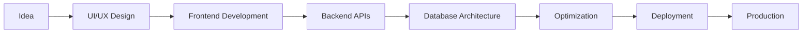

<div align="center">

# ⚡ Rizwan — Full Stack Developer & Creative Engineer


<br>


<br><br>


</div>

---

# 🌌 About Me


```yaml
Name: Rizwan
Location: Islamabad, Pakistan
Role: Full Stack Developer
Specialization:
  - Modern Web Applications
  - SaaS Platforms
  - AI Applications
  - Premium UI/UX
  - Automation Systems

Languages:
  - Python
  - JavaScript
  - TypeScript
  - SQL

Frameworks:
  - Django
  - FastAPI
  - React
  - Next.js

Passion:
  - Building Modern Digital Experiences
  - Creating Stunning Interfaces
  - Solving Real Problems With Code
```

<br>

🚀 I am a passionate full-stack developer focused on building high-quality, scalable, and visually stunning applications.

💡 I love combining:
- modern frontend experiences
- smooth animations
- strong backend architecture
- performance optimization
- premium user interfaces

⚡ My goal is to create products that feel modern, elegant, fast, and professional.

---

# 🧠 Development Philosophy

<div align="center">

| 💎 Principle | 🚀 Description |
|---|---|
| Clean Code | Maintainable & scalable architecture |
| Performance | Fast loading & optimized systems |
| UI/UX | Premium modern interfaces |
| Security | Production-grade backend security |
| Innovation | Always exploring new technologies |
| Creativity | Turning ideas into experiences |

</div>

---

# ⚒ Tech Arsenal

<div align="center">

# 🚀 Frontend Development


<br><br>

# ⚙ Backend Development


<br><br>

# 🗄 Database Systems


<br><br>

# ☁ Cloud & DevOps


<br><br>

# 🎨 Design & Animation


</div>

---

# 🔥 What I Build

<div align="center">

| 🌐 Web Apps | 🤖 AI Systems | 📱 Mobile Apps |
|---|---|---|
| SaaS Platforms | AI Tools | Android Apps |
| Dashboards | Automation Systems | Flutter Apps |
| Landing Pages | Image Processing | Food Ordering Apps |
| Portfolios | Smart Assistants | Business Apps |

</div>

---

# 🏆 Featured Skills

## 💻 Full Stack Development
- Production-grade backend systems
- API architecture
- Authentication systems
- Database optimization
- Scalable applications

---

## 🎨 Modern UI/UX
- Premium SaaS designs
- Smooth animations
- GSAP interactions
- Three.js experiences
- Responsive interfaces

---

## ⚡ Performance Optimization
- Fast loading websites
- SEO optimization
- Core Web Vitals improvements
- Clean architecture
- Efficient rendering

---

# 📊 GitHub Analytics

<div align="center">


</div>

<br>

<div align="center">


</div>

---

# 📈 Contribution Activity

<div align="center">


</div>

---

# 🚀 Current Projects

## 🌐 Premium SaaS Platforms
Modern scalable SaaS applications with:
- Authentication systems
- Admin dashboards
- Subscription systems
- API integrations
- Modern UI/UX

---

## 🤖 AI Powered Applications
Building intelligent tools including:
- Text to Image AI
- Image Enhancement
- AI Automation
- Smart Processing Systems
- AI Based Productivity Tools

---

## 📱 Mobile Applications
Developing modern apps using:
- Flutter
- Firebase
- Kotlin
- REST APIs
- Realtime Databases

---

# 🧩 Workflow & Stack



---

# ⚡ Daily Workflow

```javascript
class Rizwan {
    constructor() {
        this.name = "Rizwan";
        this.role = "Full Stack Developer";
        this.location = "Pakistan";
    }

    skills() {
        return [
            "Django",
            "FastAPI",
            "React",
            "Next.js",
            "GSAP",
            "Three.js",
            "Tailwind CSS",
            "PostgreSQL"
        ];
    }

    currentlyBuilding() {
        return [
            "AI Applications",
            "Modern SaaS Platforms",
            "Premium Web Experiences",
            "Automation Tools"
        ];
    }

    lifePhilosophy() {
        return "Code. Create. Innovate.";
    }
}

export default Rizwan;
```

---

# 🌍 Open Source Contributions

✨ I enjoy contributing to:
- Open source projects
- Developer communities
- UI/UX improvements
- Performance optimization
- Modern web experiences

---

# 💡 Fun Facts

<div align="center">

| ⚡ Fact | 🚀 Details |
|---|---|
| Favorite Language | Python |
| Favorite Frontend | React & Next.js |
| Favorite Styling | Tailwind CSS |
| Favorite Animation | GSAP |
| Favorite Backend | Django & FastAPI |
| Favorite Goal | Building World-Class Products |

</div>

---

# 🌐 Connect With Me

<div align="center">

<a href="https://github.com/YOUR_USERNAME">

</a>

<a href="https://linkedin.com/in/YOUR_USERNAME">

</a>

<a href="https://twitter.com/YOUR_USERNAME">

</a>

<a href="mailto:YOUR_EMAIL@gmail.com">

</a>

<a href="https://YOUR_WEBSITE.com">

</a>

</div>

---

# 🎯 2026 Goals

- 🚀 Launch modern SaaS products
- 🤖 Build advanced AI tools
- 🌍 Contribute more to open source
- 📱 Create scalable mobile apps
- ⚡ Learn advanced cloud infrastructure
- 💎 Build globally recognized products

---

# ☕ Support My Work

<div align="center">

<a href="https://buymeacoffee.com/YOUR_USERNAME">

</a>

</div>

---

<div align="center">


# 💙 Thanks For Visiting My Profile


### ⭐ If You Like My Work, Give A Star To My Repositories ⭐

<br>


</div>
